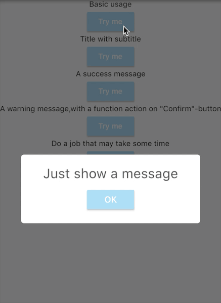
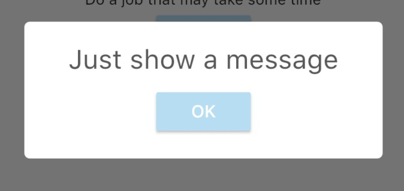
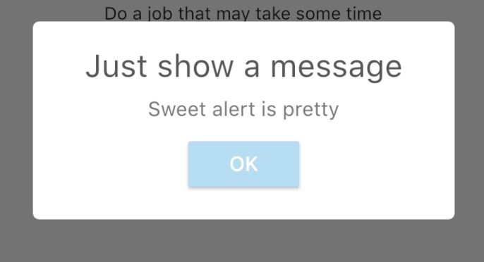
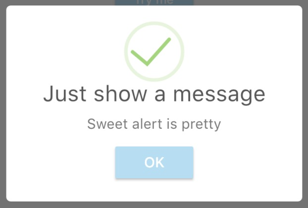
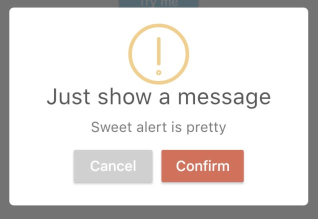

<p align="center">
	<a href="https://pub.dartlang.org/packages/sweetalertv2">
		
	</a>
</p>

# sweetalertv2

sweetalertv2 for flutter.

## Showcases



## Getting started

### Add dependency

```
sweetalertv2: any
```

### Usage


#### Basic usage


```
SweetAlertV2.show(context, title: "Just show a message");
```

#### With a subtitle



```
SweetAlertV2.show(context,
	title: "Just show a message",
	subtitle: "Sweet alert is pretty");
```

#### With a success state



```
SweetAlertV2.show(context,
	title: "Just show a message",
	subtitle: "Sweet alert is pretty",
	style: SweetAlertV2Style.success);
```

#### With a confirm state




```
SweetAlertV2.show(context,
	title: "Just show a message",
	subtitle: "Sweet alert is pretty",
	style: SweetAlertV2Style.confirm,
	showCancelButton: true, onPress: (bool isConfirm) {
		if (isConfirm) {
			SweetAlertV2.show(context,style: SweetAlertV2Style.success,title: "Success");
			// return false to keep dialog
			return false;
        }
	});
```

#### Do some job

```
SweetAlertV2.show(context,
	subtitle: "Do you want to delete this message",
	style: SweetAlertV2Style.confirm,
	showCancelButton: true, onPress: (bool isConfirm) {
		if(isConfirm){
			SweetAlertV2.show(context,subtitle: "Deleting...", style: SweetAlertV2Style.loading);
			new Future.delayed(new Duration(seconds: 2),(){
				SweetAlertV2.show(context,subtitle: "Success!", style: SweetAlertV2Style.success);
			});
		}else{
			SweetAlertV2.show(context,subtitle: "Canceled!", style: SweetAlertV2Style.error);
		}

		// return false to keep dialog
		return false;
	});
```

### Special Thanks
* best-flutter  (initial project)
